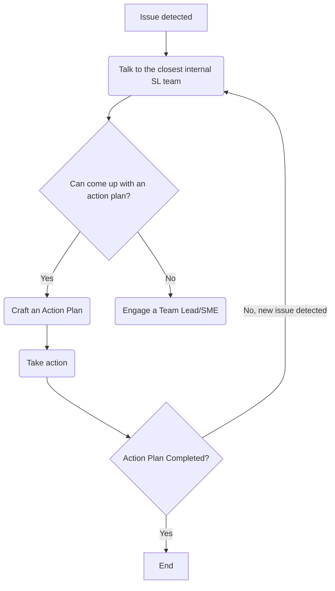

# Managing Issues

## Issues:

* General definition, a deviation from the expected behavior
  * ie. "PR/Ticket stuck in review stage"
* This process is applicable not only to code or technical issues but also to
personal relationship inside and outside of the company.

## Flow:

<!-- todo: add acronims pages -->
